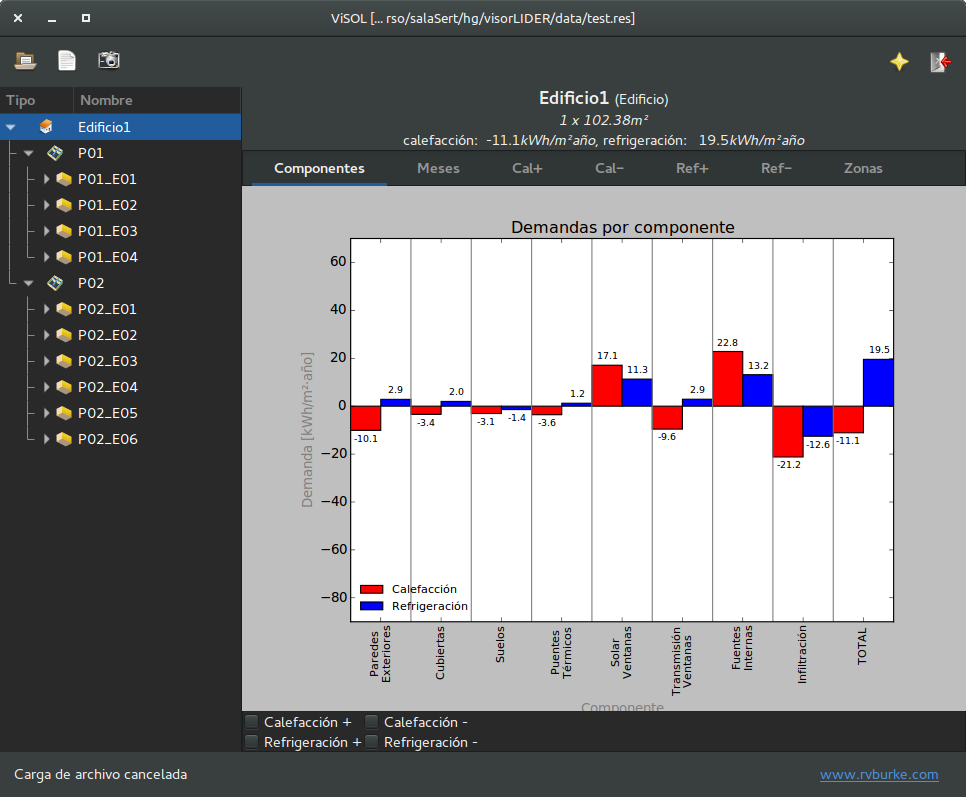
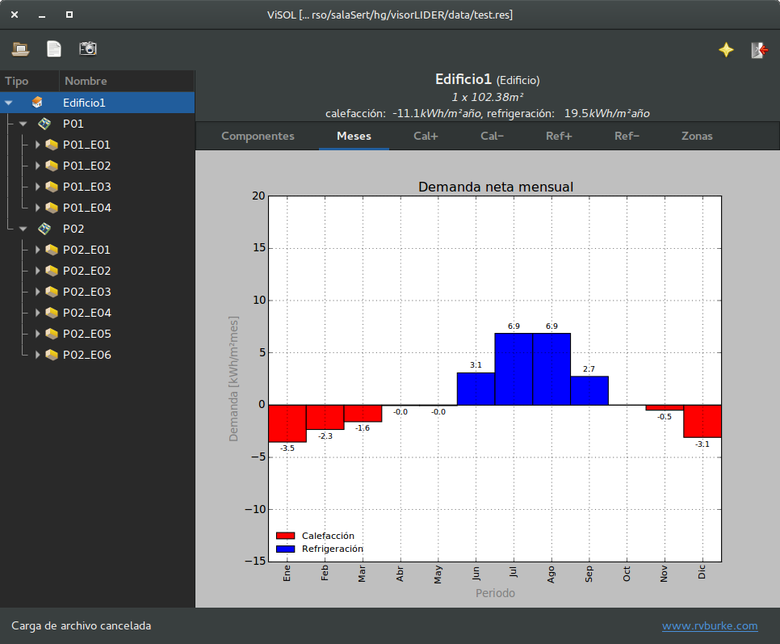
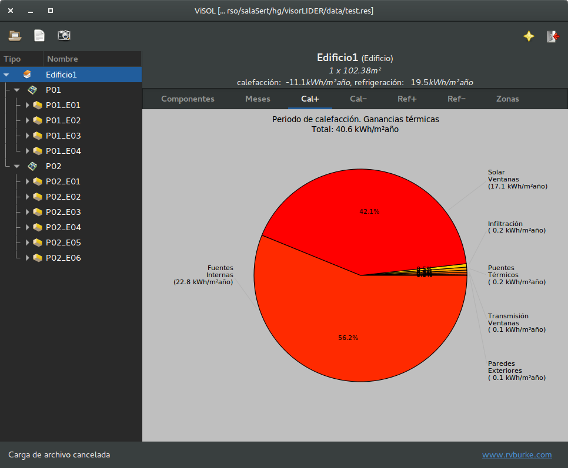
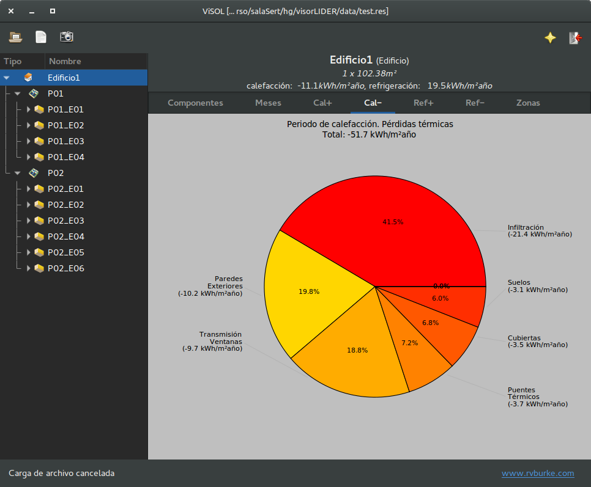
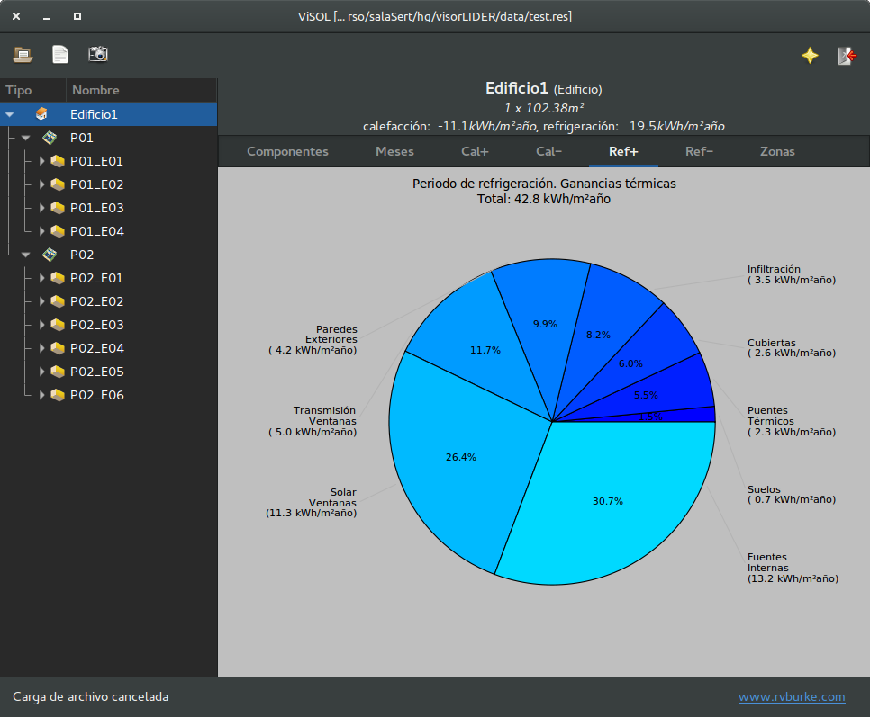
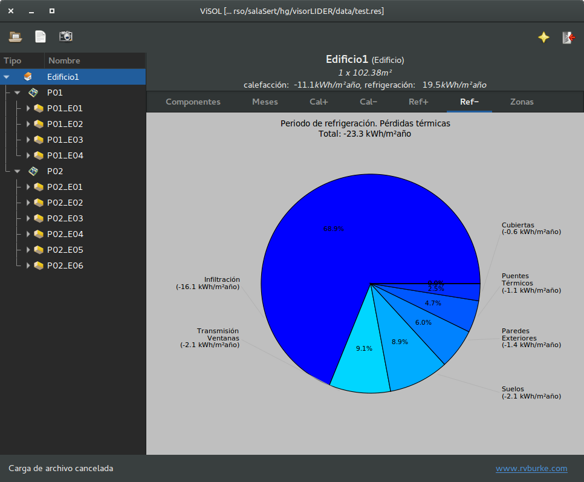
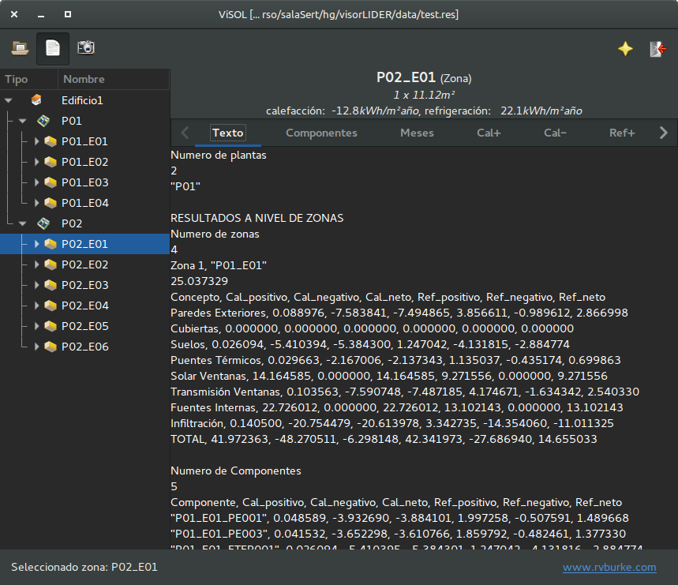
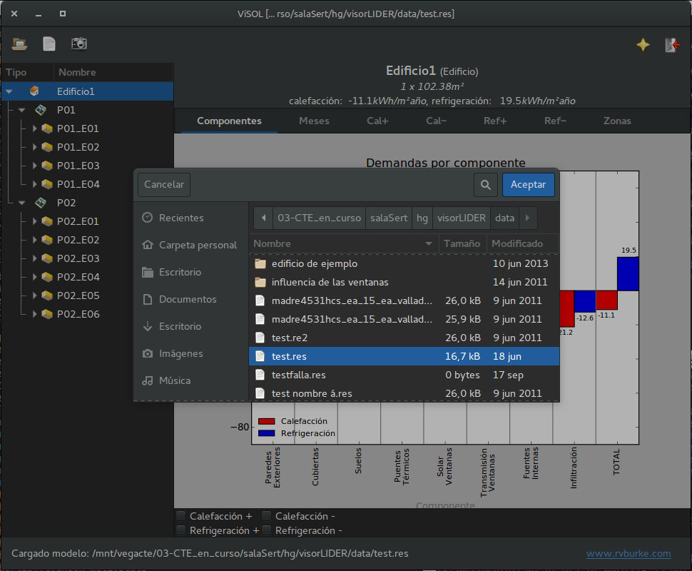

ViSol - Visor de achivos de resultados de LIDER
===============================================

Descripción
-----------

ViSol es un visor de los archivos de resultados generados por el programa LIDER,
de verificación del DB-HE del CTE.

Una vez instalado, para su uso simplemente se requiere abrir un archivo de resultados,
de extensión `.res` o `.re2`.

Los resultados se pueden explorar a nivel de edificio, espacios o componentes y se
aporta información en forma de ratios por m2 útil del edificio para cada uno de ellos
(generalmente kWh/m²·año).

El programa permite visualizar de forma rápida el comportamiento del edificio en las
temporadas de calefacción y refrigeración y detectar qué componentes de la demanda o
qué elementos son los responsables de las ganáncias (+) o pérdidas (-) de calor
en el sistema.

Esto facilita el uso de los resultados obtenidos con la herramienta LIDER o la
herramienta unificada LIDER-CALENER para el diseño.

Breve descripción de la interfaz y pantallazos
----------------------------------------------

Pantalla inicial de ViSol, con resultados a nivel de edificio, con la pestaña `Elementos` activa,
que muestra las componentes de la demanda para dicho elemento (el edificio, en este caso):

Se muestran las componentes de la demanda para el elemento actualmente seleccionado.
En este caso el elemento activo es el edificio, pero en el árbol de
la izquierda se pueden seleccionar plantas, espacios y otros elementos
del modelo.

Por defecto se muestran los valores netos de la demanda como flujo de
calor del elemento, pero se puede activar o desactivar la representación
de los flujos de pérdida de calor (-) o ganancia de calor (+) que componen
la demanda de forma independiente y de forma separada para las temporadas
de calefacción y refrigeración.

La pestaña `Meses` muestra los valores netos de la demanda neta mensual del elemento seleccionado a lo largo de los meses del año, mostrando la duración del periodo de calefacción y refrigeración:

La pestaña `cal+` muestra la composición de la demanda que supone ganancia de calor en el edificio (+) durante la temporada de calefacción:

La pestaña `cal-` muestra la composición de la demanda que supone pérdida de calor en el edificio (-) durante la temporada de calefacción:

La pestaña `ref+` muestra la composición de la demanda que supone pérdida de calor en el edificio (+) durante la temporada de refrigeración:

La pestaña `ref-` muestra la composición de la demanda que supone pérdida de calor en el edificio (-) durante la temporada de refrigeración.

La interfaz permite visualizar en una pestaña adicional el contenido de los archivos de resultados `.res` o `.re2` activos:

Para seleccionar un archivo de resultados `.res` o `.re2` basta con seleccionar el icono de selección de archivos
que permite navegar el sistema de archivos, mostrando únicamente los archivos con dichas extensiones.

Créditos
--------

- `Rafael Villar Burke`_

.. _Rafael Villar Burke: http://www.rvburke.com/software.html

Si utilizas la aplicación en publicaciones o artículos científicos agradecería que hicieses una cita de este tipo:

    VILLAR BURKE, RAFAEL, "Visol: Visor de archivos de resultados de LIDER", 2014. Disponible en: http://www.rvburke.com/software.html
